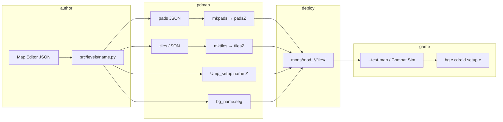

# Perfect Dark Decomp — Map Making Wiki

**The single source of truth for creating, testing, and shipping custom multiplayer
arenas in this fork.** Every claim is tied to code in this repository (`tools/pdmap/`,
`src/game/`, `journal/uff_viewer/`, PC port).

For low-level binary layouts (seg sections, pad binary records, full prop opcode table),
see [`MAP_CREATION.md`](MAP_CREATION.md). **Start here** for workflow, pitfalls, and
checklists.

---

## Table of contents

0. [Architecture overview](#0-architecture-overview)
1. [Quick start](#1-quick-start)
2. [What a map is (five files + wiring)](#2-what-a-map-is-five-files--wiring)
3. [Coordinate system and spawn height](#3-coordinate-system-and-spawn-height)
4. [The pdmap pipeline](#4-the-pdmap-pipeline)
5. [Box arenas and seg modes (`PDMAP_SEG_MODE`)](#5-box-arenas-and-seg-modes-pdmap_seg_mode)
6. [Visual and collision artifacts (read this)](#6-visual-and-collision-artifacts-read-this)
7. [Pads, props, scenarios, and validation](#7-pads-props-scenarios-and-validation)
8. [Setup, bots, and simulants](#8-setup-bots-and-simulants)
9. [Testing: CLI, editor, and `--test-map`](#9-testing-cli-editor-and---test-map)
10. [Mod loading and deploy hygiene](#10-mod-loading-and-deploy-hygiene)
11. [Map Editor (uff viewer)](#11-map-editor-uff-viewer)
12. [Registering a new stage in the engine](#12-registering-a-new-stage-in-the-engine)
13. [Runtime loading (what happens at match start)](#13-runtime-loading-what-happens-at-match-start)
14. [Custom geometry beyond box segs](#14-custom-geometry-beyond-box-segs)
15. [Pre-flight checklist](#15-pre-flight-checklist)
16. [Troubleshooting matrix](#16-troubleshooting-matrix)
17. [Command reference](#17-command-reference)
18. [Weapon ID quick reference](#18-weapon-id-quick-reference)
19. [Glossary](#19-glossary)
20. [Related files](#20-related-files)
21. [Changelog (wiki maintenance)](#21-changelog-wiki-maintenance)

---

## 0. Architecture overview



**Data flow in one sentence:** Python `MapDef` → JSON intermediates → compressed
binaries → mod `files/` → engine stage init → collision from **tiles**, spawns from
**intro + pads**, pickups from **props**, bots from **ailist 0x1000**.

---

## 1. Quick start

### Fastest path (Matrix test room / `uff` slot)

```bash
# From repo root — build game once if needed
make -j8

# Edit pads in Map Editor .app OR src/levels/uff.py, then:
PDMAP_SEG_MODE=empty python3 tools/pdmap.py build uff --seg --deploy

# Play (always loads bg_uff.* via STAGE_TEST_UFF)
./build/pd.arm64 --test-map --scenario-0 --moddir mods/mod_allinone
```

Or **Perfect Dark Map Editor.app** → **▶ Play** / **T** (Test/Play uses empty seg by default).

### New map from scratch

```bash
python3 tools/pdmap.py init mymap
# edit src/levels/mymap.py
python3 tools/pdmap.py build mymap --seg --deploy
python3 tools/pdmap.py validate mymap
python3 tools/pdmap.py info mymap
```

Register the stage (§12) before expecting it in the Combat Simulator menu. Until then,
use **Deploy → uff** in the editor to hijack the `--test-map` slot.

### Deterministic path (editor JSON → playable, no level module)

```bash
# Canonical CLI — all invariants applied in code (spawn Y, loadout, ailist 0x1000, empty seg)
python3 tools/pdmap.py from-json map.json --deploy-as uff --deploy --play

# Learning engine — probe code + fixtures, track doc gaps, emit verified spec
python3 tools/pdmap.py learn run
python3 tools/pdmap.py learn report
python3 tools/pdmap.py learn gaps
python3 tools/pdmap.py register mymap   # four C wiring snippets → journal/map_learn/
```

Output: `docs/MAP_DETERMINISTIC_SPEC.md` (machine-verified facts only) and
`journal/map_learn/gaps.md` (what still needs encoding or documentation).

---

## 2. What a map is (five files + wiring)

Each stage `<name>` needs **five deployed assets** plus **four engine wiring points**
(for menu / non-test-map loads).

### Asset files

| Deployed path | Role | Built by |
|---|---|---|
| `files/bgdata/bg_<name>.seg` | Visible room geometry (F3DEX2) + Section-3 room bboxes | `seg.py` (box), `SEG_SCRIPT`, or custom script |
| `files/bgdata/bg_<name>_tilesZ` | **Collision** floor/walls (RareZip compressed) | `mktiles` ← JSON |
| `files/bgdata/bg_<name>_padsZ` | Pad anchors + waypoint graph (RareZip) | `mkpads` ← JSON |
| `files/Usetup<name>Z` | Solo setup (optional for pure MP test) | legacy / rarely needed |
| `files/Ump_setup<name>Z` | **MP setup** — intro, props, ailists | `setup_packer.py` ← `MapDef.pack_setup()` |

The **`Z` suffix** means RareZip-compressed on disk (same as stock PD assets). Engine
paths in `list.c` use the `Z` names, e.g. `"bgdata/bg_uff_tilesZ"`.

### Build tree (before deploy)

| Path | Contents |
|---|---|
| `build/ntsc-final/assets/files/bgdata/` | Compiled `bg_*_tilesZ`, `bg_*_padsZ`, `bg_*.seg` |
| `build/ntsc-final/Ump_setup<name>Z` | Uncompressed setup binary |
| `src/assets/ntsc-final/tiles/<name>.json` | Tiles source JSON |
| `src/assets/ntsc-final/pads/<name>.json` | Pads source JSON (generated) |
| `src/levels/<name>.py` | Level module (`build()` → `MapDef`) |

### Critical distinctions

| System | Source | If wrong |
|---|---|---|
| **Collision / floor** | **Tiles** (`_tilesZ`) | Fall through world |
| **Room assignment** | Seg Section-3 bboxes + pad room index | No collision, wrong culling |
| **Player/bot spawns** | Intro `Spawn(pad=…)` + pads | Origin pile or void |
| **Floor weapon/ammo pickups** | Props (`Weapon`, `AmmoCrate`) on pads | Missing pickups |
| **Starting loadout** | Intro `Weapon`/`Ammo` (not pad-indexed) | Wrong guns at match start |
| **Bots** | Ailist id `0x1000` in setup | Bots at Y≈−99900 |
| **Visible walls** | Seg (optional for gameplay) | Grey void OK if tiles exist |

### Mod layout

```
mods/mod_allinone/
  modconfig.txt          # optional per-stage overrides (allocation, music)
  files/
    Ump_setupuffZ
    bgdata/
      bg_uff.seg
      bg_uff_tilesZ
      bg_uff_padsZ
```

External load: `--moddir mods/mod_allinone` → `files/` under that path
(`ROMDATA_FILEDIR` in `port/src/romdata.c`). Log line to confirm:

`file 37 (bgdata/bg_uff.seg) loaded externally (g_ModNum: 0)`

### Four wiring points (new stages only)

1. `src/include/files.h` — `FILE_*` constants (sequential IDs)
2. `src/assets/ntsc-final/files/list.c` — path strings at matching indices
3. `src/game/stagetable.c` — `g_Stages[]` row
4. `src/game/mplayer/setup.c` — `g_MpArenas[]` + **`groups[]` absolute indices**

`STAGE_TEST_UFF` (`0x4D`) is **already wired** for the uff test slot — no registration
needed for `--test-map`.

---

## 3. Coordinate system and spawn height

| Axis | Direction |
|---|---|
| X+ | East (right) |
| Y+ | Up |
| Z+ | South |

**Units:** ~1 unit ≈ 1 cm. `BOX_HALF=5000` → ~100 m × 100 m floor.

### The ×6 transform (tiles only)

Tiles JSON vertex coordinates are stored in **source units**, then multiplied by **6**
when compiled (`to_scaled_hex()` in `tools/pdmap/core.py`). Runtime divides by 6
(`pd/arm/bg.cpp`). **Pads JSON uses raw game coordinates** (not ×6).

Example: floor at `Y=0` in tiles JSON → `Y=0` in world. Pad at `Y=10` stays `Y=10`.

### Spawn Y (`SPAWN_Y = 10`)

Pads must sit **slightly above the floor** (`Y > 0`, typically **`Y = 10`**):

- Ground search (`cdFindGroundFromList`) requires `floor_y < pad_y`.
- `Y = 0` on spawn/weapon/ammo pads → floor rejected → **fall through**.
- `Y = 10` is safe; player is snapped to floor — negligible fall damage.
- **`Y ≥ 20`** in open boxes → fall damage on spawn (avoid).

### Room index

| Room | Meaning |
|---|---|
| **0** | Void — **must be empty** in tiles JSON (no collision tiles) |
| **1** | First playable room (standard for box arenas) |
| **N** | Pad `room` must be `< num_rooms` in tiles binary |

Pads outside the floor XZ footprint (`|x|,|z| > BOX_HALF`) still compile but warn in
the editor; spawns may miss collision tiles.

### Section-3 bbox (seg)

Box segs set Section-3 bboxes to span the full s16 range so spawns resolve to room 1.
Custom segs must cover all playable coordinates or players get **no room** → void fall
(§16).

---

## 4. The pdmap pipeline

### CLI

```bash
python3 tools/pdmap.py init <name>      # scaffold src/levels/<name>.py
python3 tools/pdmap.py build <name> [--seg] [--deploy] [--no-validate]
python3 tools/pdmap.py validate <name>
python3 tools/pdmap.py info <name>
python3 tools/pdmap.py deploy <name>
python3 tools/pdmap.py list
```

### `build` steps (in order)

1. Load `src/levels/<name>.py` → `mapdef = mod.build()`
2. **Seg** — if `--seg`, `SEG_SCRIPT`, or `BOX_HALF`+`BOX_HEIGHT`:
   - Rebuild box seg (never silently redeploy stale `BUILD_DIR` seg for box levels)
   - Custom: run `SEG_SCRIPT` or `--seg path/to/script.py`
3. `write_pads_json(mapdef)` → `compile_pads` → `bg_<name>_padsZ`
4. Tiles: `build_tiles_json()` if present, else existing JSON, else copy template **`mp14`**
5. `compile_tiles` → `bg_<name>_tilesZ`
6. `write_setup_binary` → `Ump_setup<name>Z` (includes ailist `0x1000`)
7. **`--deploy`** → all mods in `MOD_DIRS` + setup to each mod's `files/`
8. **`validate_all`** unless `--no-validate`

### Level module pattern

```python
from tools.pdmap.core import MapDef
from tools.pdmap.intro import Spawn
from tools.pdmap.builders import (
    add_spawn_grid, add_loadout_intro, add_mp_scenarios,
    add_floor_weapons, add_ammo_row, floor_box_tiles,
)
from tools.pdmap import weapons as W

BOX_HALF = 5000.0      # shared by tiles + box seg
BOX_HEIGHT = 3000.0
SPAWN_Y = 10.0

def build() -> MapDef:
    g = MapDef("mymap")
    add_spawn_grid(g, [(-2000, -2000), (2000, 2000)], y=SPAWN_Y)
    g.add_pad(index=2, x=0, y=SPAWN_Y, z=0, room=1)
    add_floor_weapons(g, [(2, W.WEAPON_AR34)])
    add_loadout_intro(g)   # ailist 0x1000 + starting weapons/ammo
    return g

def build_tiles_json():
    return floor_box_tiles("mymap", half=BOX_HALF, y=0.0, room_index=1)
```

### Pad index rule (silent footgun)

`add_pad(index=k, …)` must use **contiguous `k = 0..N-1` in array order**. `mkpads`
numbers pads by **array position**; intro/props reference **position**, not the label
you pass to `add_pad()`. Sparse indices break weapons and spawns with no build error.

`pdmap validate` enforces this. The editor enforces contiguous indices in JSON export.

### Builder helpers (`tools/pdmap/builders.py`)

| Function | Purpose |
|---|---|
| `add_spawn_grid(g, positions, y=SPAWN_Y)` | Spawn pads + `Intro(Spawn)` |
| `add_loadout_intro(g)` | Starting weapons/ammo + **required for bots** (via `pack_setup`) |
| `add_mp_scenarios(g, cases=[(team, case_pad, respawn_pad)], hill_pads=[…])` | CTF + KOTH intro |
| `add_floor_weapons(g, [(pad, weapon_id), …])` | Weapon **props** on floor |
| `add_ammo_row(g, [pad, …], ammotype=…)` | Ammo crate **props** |
| `floor_box_tiles(name, half, y=0, room_index=1)` | Single-room floor collision |
| `configure_matrix_test_room()` | Stock `uff` layout reference |

---

## 5. Box arenas and seg modes (`PDMAP_SEG_MODE`)

Procedural box segs: `tools/pdmap/seg.py` → `build_box_seg()` / `write_box_seg()`.

| Mode | Faces drawn | Use when |
|---|---|---|
| **`empty`** (Test/Play default) | None (setup GDL only) | **In-box FPS** — clean view |
| **`full`** | Ceiling + 4 walls (no floor) | Coloured shell; may near-clip |
| **`box`** | Ceiling + 2 walls | Minimal shell |
| **`floor`** | Floor quad only | Debug — **viewport artifact** inside box |

```bash
PDMAP_SEG_MODE=empty python3 tools/pdmap.py build uff --seg --deploy
PDMAP_SEG_MODE=full  python3 tools/pdmap.py build uff --seg --deploy
```

`journal/uff_viewer/test_map.py` sets `PDMAP_SEG_MODE=empty` via `setdefault` for box builds.

### Floor face omitted from `full` / `box`

Floor at `Y=0` spans the entire arena. Camera at `Y=10` inside the box puts that plane
behind the near clip → **dark sheet on viewport** (§6.2). Floor **collision** still
from tiles; seg floor is visual-only.

### G_VTX rule (mandatory)

F3DEX2 vertex count lives in a **4-bit nibble** (max **16 verts per `G_VTX`**).

| Wrong | Right |
|---|---|
| One `G_VTX(24)` for all faces | One `G_VTX(4)` **per face** |
| Collision loads 8 verts, draws 24 | Renderer and collision agree |

Deploy **refuses** bad segs (`validate_seg_g_vtx` in `deploy.py`).

Evidence: `python3 journal/uff_viewer/gen_uff_viewer.py` → `uff_gdl_dump.txt`

---

## 6. Visual and collision artifacts (read this)

### 6.1 Phantom collision wall (G_VTX overflow)

| | |
|---|---|
| **Symptoms** | Invisible surface near origin; follows camera; bullet holes; **blocks movement** |
| **Cause** | Single large `G_VTX`; `bgTestHitInVtxBatch` loads 8 verts, walks all triangles |
| **Fix** | `python3 tools/pdmap.py build uff --seg --deploy` |
| **Never** | Uncheck **Seg** in editor; copy stale seg by hand |

### 6.2 Viewport-blocking sheet (near-plane clip)

| | |
|---|---|
| **Symptoms** | Dark grey/blurred rectangle glued to screen; **not collidable**; mod seg loads OK |
| **Cause** | Huge seg faces behind near plane (`gfx_clip_triangle_near`, `gfx_pc.cpp`) |
| **Fix** | `PDMAP_SEG_MODE=empty` + rebuild + deploy |

### 6.3 “Matrix white” room

Flat white geometry → `gfxMakeRoomWhite()`. **UFF fix:** `STAGE_TEST_UFF` uses
`gfxMakeRoomUseShadeRecursively()` + per-face vertex colours in seg setup (`bg.c`).

### 6.4 Decision tree

```
Blocking view in FPS?
├─ Dark sheet, not collidable → §6.2 → PDMAP_SEG_MODE=empty
├─ Near origin, bullet holes, blocked → §6.1 → per-face G_VTX seg
├─ Falls forever → §16 → tiles / pad Y / bbox
└─ No bots → §8 → ailist 0x1000, chrslots, spawns
```

---

## 7. Pads, props, scenarios, and validation

### Pad types (editor / `MapDef`)

| Type | Purpose |
|---|---|
| `spawn` | `Intro(Spawn(pad=…))` — players and bots |
| `weapon` | Floor `Weapon` prop on pad |
| `ammo` | Floor `AmmoCrate` prop |
| `scenario` | Case / Hill intro anchors |
| `other` | Reserved / unused |

### Waypoint graph (automatic)

`MapDef.pack_pads_json()` builds a **symmetric** k-nearest graph (`K_NEAREST = 6`):
every edge A→B also gets B→A. Asymmetric graphs crash in `waypointFindRoute`
(`padhalllv.c`) — NULL neighbour dereference.

Do not hand-edit waypoints to one-way links unless you mirror them.

### Overlapping pads

| OK | Not OK |
|---|---|
| spawn + weapon + ammo at same XZ | two **spawn** at same spot |
| center AR34 + shotgun ammo at `(0,10,0)` | two **weapon** at same spot |

Editor Test/Play: only **same-type** overlaps block (unless **Warn OK**). Near-origin
warnings apply to **spawn** pads within ~80 units of origin at `Y≤20`.

### Two weapon ID namespaces (critical)

The engine uses **different enums** for different systems:

| Context | Enum | Example AR34 | Defined in |
|---|---|---|---|
| **Floor weapon props**, intro `Weapon()` in setup | `weaponnum` / `WEAPON_*` | `0x11` | `tools/pdmap/weapons.py`, `constants.h` |
| **`--test-map --loadout`**, Combat Sim menu loadout | `MPWEAPON_*` | `0x10` | `constants.h` |

Default editor loadout (`test_map.py`): `1,9,16,4,0,37` = Falcon2, CMP150, AR34,
MagSec4, None, Shield in **MPWEAPON** space.

Floor pickup in editor uses **weaponnum** (`0x11` for AR34 in weapon catalog).

Mixing these up gives wrong guns or silent intro failures — see [`MAP_CREATION.md` §6](MAP_CREATION.md#6-the-setup-format) intro table.

### Intro commands (player loadout vs world)

| Command | param1 | param2 | Notes |
|---|---|---|---|
| `Spawn` | pad index | — | Fills `g_SpawnPoints[]` |
| `Weapon` | weapon id | dual id or **-1** | **Not a pad index** |
| `Ammo` | ammo type | **quantity** | **Not a pad index** |
| `Case` | team | pad | CTF case location |
| `CaseRespawn` | team | pad | CTF respawn |
| `Hill` | pad | — | KOTH zone |

### Floor props (pickups)

```python
add_floor_weapons(g, [(pad_index, W.WEAPON_AR34)])
add_ammo_row(g, [pad_index], ammotype=W.AMMOTYPE_RIFLE)
```

`Weapon` prop uses **`chr_=pad_index`** internally (legacy field name = pad). Default
`OBJFLAG_FALL` so pickups drop to floor. Props spawn during stage setup — **independent**
of bot pipeline; render when room is onscreen.

### Scenarios (`--scenario-0` … `--scenario-5`)

| ID | Name | Intro needed |
|---|---|---|
| 0 | Combat | Spawns only |
| 1 | Hold the Briefcase | — |
| 2 | Hacker Central | — |
| 3 | Pop a Cap | — |
| 4 | King of the Hill | `Hill(pad=…)` per hill pad |
| 5 | Capture the Case | `Case` + **`CaseRespawn`** per team |

**Editor:** place two scenario pads per CTF team — **Capture the Case** (intro `Case`)
and **Case respawn (CTF)** (intro `CaseRespawn`). Export emits both via JSON and Python.

```python
add_mp_scenarios(g,
    cases=[(0, case_pad, respawn_pad), (1, …, …)],
    hill_pads=[hill_pad, …],
)
```

### KOTH hill visual markers (box arenas)

KOTH capture is **room-based** (`kingofthehill.inc`): the engine highlights the hill
pad's **room** green (then team colour when occupied). A single-room box arena makes
the **entire floor** the hill — gameplay may work but there is no visible boundary.

**Required for readable KOTH in box maps:**

1. **Hill pad in room 2** (`room=2` on the scenario pad; spawn stays in room 1).
2. **Floor tiles in room 2** covering only the capture square (typically
   `floor_box_with_hill_zone()` in `tools/pdmap/builders.py`).
3. **Matching collision in room 1** — same hill square quad duplicated in room 1
   tiles. pdmap box segs are single-room; collision geo is collected only from the
   player's seg room list (room 1). Without the room-1 hill quad, the cut-out hole
   has no floor and players fall through the green seg marker.
4. **Ring tiles in room 1** — dark seg floor strips just outside the hill square
   mark the boundary (collision ring tiles in room 1 mirror the same layout).
5. **`PDMAP_SEG_MODE=hill` seg (room 1 only)** — floor quads for arena, dark ring,
   and static green hill square. Tiles stay in room 2 for KOTH capture; seg must
   stay **single-room** (multi-room custom segs crash in ``relinkPtr``). KOTH
   pulse tints tile room 2; the hill square stays visibly green via seg colour.

`from-json` / `EditorMapSpec.tiles_json()` auto-emits hill zone tiles when a `Hill`
intro command is present. Constants: `HILL_ZONE_HALF=600`, `HILL_RING_WIDTH=100`,
colours `HILL_ZONE_COLOUR` / `HILL_RING_COLOUR`.

```python
from tools.pdmap.builders import floor_box_with_hill_zone, HILL_ROOM_INDEX

g.add_pad(index=hill_pad, x=0, y=SPAWN_Y, z=1500, room=HILL_ROOM_INDEX)
g.add_intro(Hill(pad=hill_pad))

def build_tiles_json():
    return floor_box_with_hill_zone(
        "mymap", half=BOX_HALF, y=0.0,
        hill_center_x=0.0, hill_center_z=1500.0,
    )
```

Launch with `--scenario-4`. Production maps `my_arena` and `testarena` use the same
pattern.

### pdmap `validate` checks

- Contiguous pad indices 0..N-1
- Pad `Y > 0`
- At least one `Spawn`; warns if no `Case`/`Hill` for scenarios
- Intro references valid pads
- Prop pack non-empty
- Pad room `< tiles num_rooms`
- Seg G_VTX loads (if seg exists)
- Warns if first intro command is not `Spawn`

### Editor JSON schema

```json
{
  "name": "uff",
  "box_half": 5000,
  "box_height": 3000,
  "pads": [
    {"index": 0, "type": "spawn", "x": 0, "y": 10, "z": 0, "room": 1},
    {"index": 1, "type": "weapon", "x": 500, "y": 10, "z": 0, "room": 1, "weapon": 17},
    {"index": 2, "type": "ammo", "x": -500, "y": 10, "z": 0, "room": 1,
     "ammoType": 4, "quantity": 200},
    {"index": 3, "type": "scenario", "x": 0, "y": 10, "z": 1000, "room": 1,
     "scenario": "hill", "team": 0}
  ]
}
```

`index` **must equal array position** (0..N-1). Validated by `json_to_level.py` and
the editor before export.

---

## 8. Setup, bots, and simulants

Three independent requirements:

### 8.1 MP init ailist (`id = 0x1000`)

`MapDef.pack_setup()` always emits:

```
mp_init_simulants → rebuild_teams → rebuild_squadrons → set_ailist → endlist
```

Without it: bots allocated at origin, room −1, fall to **`Y ≈ -99900`**.

### 8.2 Quick-team chrslots

`--test-map` sets **`g_MpSetup.chrslots = 0x01`** only (`title.c`). Pre-setting
simulant bits breaks `mpGetSlotForNewBot()`.

### 8.3 Spawns + symmetric waypoints

Multiple `Spawn(pad=…)` at distinct pads above floor inside room bbox.

### Bot count and difficulty

| Setting | CLI / editor | Notes |
|---|---|---|
| Sim count | `--num-sims N` (default 8) | Stock profile caps at **4** unless `MPFEATURE_8BOTS` |
| Difficulty | `--sim-difficulty 0–5` | Meat=0 … Dark=5; clamped in `title.c` |
| MP options | `--mp-options 0x…` | Bitmask → `g_MpSetup.options` |

### Diagnostic table

| Symptom | Likely cause |
|---|---|
| 0 bots | No ailist 0x1000 or quick-team off |
| Bots at Y≈−99900 | Ailist never ran `botSpawnAll` |
| Crash in `waypointFindRoute` | Asymmetric waypoints (should not happen with pdmap) |
| Bots at origin pile | Empty `g_SpawnPoints[]` |
| 4 bots when asking for 8 | Stock cap (normal) |
| Pickups missing | Wrong pad index / prop not built / huge arena |

---

## 9. Testing: CLI, editor, and `--test-map`

### `--test-map` behaviour (`title.c`)

- Stage: **`STAGE_TEST_UFF`** (`0x4D`) → always **`bg_uff.*`** file IDs
- Scenario: `--scenario-0` … `--scenario-5`
- Quick-team: `--num-sims`, `--sim-difficulty`
- Loadout: `--loadout W0,W1,W2,W3,W4,W5` (**MPWEAPON** ids)
- **`g_MpSetup.chrslots = 0x01`**

```bash
./build/pd.arm64 --test-map --scenario-5 \
  --moddir mods/mod_allinone \
  --num-sims 4 --sim-difficulty 2 \
  --loadout 1,9,16,4,0,37 \
  --mp-options 0
```

### Level name vs deploy name

| Concept | Example | Written to |
|---|---|---|
| **Level module** | `myarena` | `src/levels/myarena.py` (optional copy) |
| **Deploy / asset name** | `uff` | Built binaries `bg_uff.*`, play via `--test-map` |

Editor: **Level** = module name; **Deploy → uff (test-map slot)** = asset name.

`test_map.py --deploy-as uff` builds/deploys **`uff`** assets while keeping a separate
level module if needed.

If `deploy_name != uff` and you use `--play` without registration → warning: game will
not load your map.

### `test_map.py` pipeline

```bash
python3 journal/uff_viewer/test_map.py map.json \
  --level myarena --deploy-as uff \
  --mod mod_allinone \
  --seg --deploy --play --write-artifacts
```

| Flag | Default | Meaning |
|---|---|---|
| `--seg` / `--no-seg` | seg on | Box seg rebuild |
| `--deploy` / `--no-deploy` | deploy on | Copy to mod |
| `--skip-validate` | off | Skip pdmap validate |
| `--backup` / `--no-backup` | backup on | `.py.bak` before overwrite |
| `--rebuild-game` | off | `cmake --build build --target pd` |
| `--dry-run` | off | Print shell script only |

Artifacts: `.last_test.json`, `.last_test.sh`, `.last_play.sh`

### Confirm external assets

```
file 37 (bgdata/bg_uff.seg) loaded externally
file 468 (bgdata/bg_uff_tilesZ) loaded externally
file 466 (Ump_setupuffZ) loaded externally
```

Missing → ROM embedded data; add `--moddir` and redeploy.

---

## 10. Mod loading and deploy hygiene

### Always pass moddir

```bash
--moddir mods/mod_allinone
```

### Rebuild after every edit

```python
# Editing uff.py alone does NOT update mod binaries.
PDMAP_SEG_MODE=empty python3 tools/pdmap.py build uff --seg --deploy
```

### Deploy targets (`MOD_DIRS`)

`mod_allinone`, `mod_dark_noon`, `mod_gex`, `mod_kakariko`, `mod_goldfinger_64`, `mod_moyoteg`
(dirs that exist under `mods/*/files/bgdata`).

- **Setup** deploys to selected mod's `files/`
- **Box seg** syncs to **all** mod bgdata dirs (`test_map.py` / `build_box_seg_asset`)

### Optional `modconfig.txt`

Per-mod text file (e.g. `mods/mod_allinone/modconfig.txt`). Can override stage
allocation strings (`stage 0x18 { allocation "…" }`). Parsed in `port/src/mod.c`.
Not required for basic uff testing.

### Stale asset regressions

| Mistake | Result |
|---|---|
| Deploy without `--seg` on box level | Old G_VTX(24) seg |
| Editor **Seg** unchecked | Same |
| Manual copy to one mod only | Other mod launchers load stale uff |
| Run `test_map.py` on wrong JSON | Overwrites `src/levels/uff.py` — use `--backup`, git |
| Open `uff_map.html` via `file://` | No API / Test/Play broken |

---

## 11. Map Editor (uff viewer)

Location: `journal/uff_viewer/`

### Launch

```bash
./scripts/build-map-editor-electron.sh     # production .app
python3 journal/uff_viewer/serve_editor.py # http://127.0.0.1:8765/
```

Requires **local server** — not `file://`. Port **8765–8775** auto-fallback.

### Standard workflow

1. Launch **Perfect Dark Map Editor.app**
2. **File → Open…** or drag `.json` onto canvas
3. **E** — edit mode; place pads at **`Y=10`**
4. **⌘S** — save to `journal/uff_viewer/maps/` (or App Support if repo read-only)
5. Run bar: **Mod**, **Scenario**, **▶ Play** (or **T**)
6. **Play → Build Settings…** — Level, Deploy slot, sims, loadout, Seg/Deploy flags

### Test / Play gates

| Gate | Behaviour |
|---|---|
| Validation **errors** | Block until fixed (missing weapon id, Y<0, 0 spawns) |
| Validation **warnings** | Confirm dialog; enable **Warn OK** to auto-proceed |
| Same-type overlap | Warning (stock uff spawn+ammo at center is OK) |

### Keyboard shortcuts

| Key | Action |
|---|---|
| `T` | Test / Play |
| `X` | Export assets (build, no launch) |
| `E` | Toggle edit mode |
| `F` | Fly mode |
| `⌘S` | Save |
| `⌘Z` / `⌘⇧Z` | Undo / redo |
| `Del` | Delete selected pad |

Full IA: [`journal/uff_viewer/UI.md`](../journal/uff_viewer/UI.md)

### REST API (`serve_editor.py`)

| Endpoint | Method | Purpose |
|---|---|---|
| `/api/health` | GET | Server up |
| `/api/maps` | GET | List saved maps |
| `/api/maps/<name>` | GET/PUT/DELETE | Load/save/delete map JSON |
| `/api/test-map` | POST | Run `test_map.py` pipeline |

### Saved maps

- Writable repo: `journal/uff_viewer/maps/*.json`
- Else: `~/Library/Application Support/PerfectDarkMapEditor/maps/`
- Log: `~/Library/Logs/PerfectDarkMapEditor.log`

Regenerate HTML after Python/level changes:

```bash
python3 journal/uff_viewer/gen_uff_viewer.py
./scripts/build-map-editor-electron.sh   # sync into .app bundle
```

---

## 12. Registering a new stage in the engine

Required to load `bg_mymap.*` outside the uff test slot.

1. **`src/include/files.h`** — five `FILE_*` constants (next free IDs)
2. **`src/assets/ntsc-final/files/list.c`** — `"bgdata/bg_mymap.seg"`, `"…_tilesZ"`, etc.
3. **`src/game/stagetable.c`** — `g_Stages[]` row with five file IDs
4. **`src/game/mplayer/setup.c`** — `g_MpArenas[]` entry; **fix all `groups[]` offsets**

`STAGE_TEST_UFF` is already registered (Custom Box Level in Combat Sim). UFF-specific
env/sky: `env.c`, `sky.c`; memory allocation hint: `pdmain.c` `-ml0 -me0 -mgfx120 …`.

Full walkthrough: [`MAP_CREATION.md` §10](MAP_CREATION.md#10-stage-registration--the-four-wiring-points).

After registration:

```bash
python3 tools/pdmap.py build mymap --seg --deploy
# Combat Sim menu, or:
./build/pd.arm64 --boot-stage 0xXX --skip-intro --moddir mods/mod_allinone
```

(`--test-map` remains uff-only.)

---

## 13. Runtime loading (what happens at match start)

Order in `bg.c`, `cdroid.c`, `setup.c`, `playerreset.c`:

1. **`cdInitTiles()`** — collision grid from `_tilesZ`
2. **`bg_load_stage()`** — decompress seg; link room GDLs; Section-3 bboxes → room IDs
3. **`pdLoad()`** — pad positions; waypoint graph
4. **`setupLoad()`** — props + intro + ailists
5. **Intro processing** — `INTROCMD_SPAWN` → `g_SpawnPoints[]`
6. **Ailist ≥0x1000** — background chr runs MP init → `botSpawnAll()`
7. **Quick-team** — `mpCreateBotFromProfile()` if enabled
8. **Player spawn** — `playerChooseSpawnLocation()` from `g_SpawnPoints[]`

**Props** (weapons/ammo on floor) activate during setup — separate from step 6–7.

Room onscreen culling: props only draw when `prop->rooms[]` has `ROOMFLAG_ONSCREEN`.

---

## 14. Custom geometry beyond box segs

### When box seg is enough

Any flat-floor arena with `BOX_HALF` / `BOX_HEIGHT` matching tiles: use bare
`--seg` or `pdmap build name --seg` — no `SEG_SCRIPT` required.

### Bespoke seg

1. **`SEG_SCRIPT`** in level module pointing to a generator script
2. Script must write `bg_<name>.seg` next to itself
3. `pdmap build name --seg` runs the script via `deploy.build_seg()`

Reference: `scripts/build_custom_seg.py` (legacy uff colours / Matrix room).

### Custom tiles

Export `build_tiles_json()` with `gen_quad_tile_data()` / manual room entries.
Room 0 must stay empty. Match floor Y to pad `SPAWN_Y` offset.

### Covers (optional AI)

`g.add_cover(x, z, y=10, …)` — AI cover points; separate from pads.

---

## 15. Pre-flight checklist

- [ ] `python3 tools/pdmap.py validate <name>` — zero errors
- [ ] `python3 tools/pdmap.py build <name> --seg --deploy` completed
- [ ] Box arena: fresh seg; G_VTX loads ≤ 16 in `uff_gdl_dump.txt`
- [ ] Test/Play: `PDMAP_SEG_MODE=empty` (automatic in editor)
- [ ] Pads: `Y=10`, contiguous indices, ≥4 spawns for MP
- [ ] CTF: `Case` **and** `CaseRespawn` pads wired per team (editor scenario modes)
- [ ] Setup includes ailist **0x1000** (`add_loadout_intro`)
- [ ] Launch with `--moddir mods/mod_allinone`
- [ ] Log shows `bg_<name>.* loaded externally`
- [ ] FPS view clear (no §6.2 sheet)
- [ ] Player lands; bots spawn and pathfind
- [ ] Floor pickups visible when room onscreen

---

## 16. Troubleshooting matrix

| Symptom | Section | Fix |
|---|---|---|
| Dark/blurred sheet on screen | §6.2 | `PDMAP_SEG_MODE=empty`, rebuild+deploy |
| Phantom wall at origin | §6.1 | Per-face G_VTX seg, `--seg` on build |
| Falls through floor | §3, §7 | Pad Y>0; tiles in room 1; seg bbox |
| White room | §6.3 | UFF shade path / vertex colours |
| No bots | §8 | ailist 0x1000; chrslots=0x01; spawns |
| Bot crash after few seconds | §8 | Symmetric waypoints (pdmap default) |
| Wrong map in menu | §12 | `groups[]` indices in setup.c |
| Changes ignored | §10 | `--moddir`; rebuild `--deploy` |
| Editor play blocked | §11 | Fix errors; OK / Warn OK on warnings |
| `--test-map` wrong geometry | §9 | Deploy as **uff** or register stage |
| Wrong starting guns | §7 | `--loadout` uses **MPWEAPON** ids |
| Floor pickup wrong/missing | §7 | Prop uses **weaponnum** id; pad index |
| CTF broken from editor | §7 | Add paired **Case** + **Case respawn** scenario pads per team |
| Only 4 bots | §8 | Stock cap (normal) |
| Overwrote uff.py | §10 | `git checkout src/levels/uff.py` |

---

## 17. Command reference

```bash
# Scaffold
python3 tools/pdmap.py init mymap

# Build & deploy (play-safe seg)
PDMAP_SEG_MODE=empty python3 tools/pdmap.py build uff --seg --deploy

# Build & deploy (visible walls)
PDMAP_SEG_MODE=full python3 tools/pdmap.py build uff --seg --deploy

# Inspect
python3 tools/pdmap.py validate uff
python3 tools/pdmap.py info uff
python3 tools/pdmap.py list

# Play
./build/pd.arm64 --test-map --scenario-0 --moddir mods/mod_allinone

# Editor backend (full pipeline)
python3 journal/uff_viewer/test_map.py journal/uff_viewer/maps/foo.json \
  --deploy-as uff --mod mod_allinone --play --write-artifacts

# Editor server / HTML regen
python3 journal/uff_viewer/serve_editor.py
python3 journal/uff_viewer/gen_uff_viewer.py
./scripts/build-map-editor-electron.sh

# Replay last launch
bash journal/uff_viewer/.last_play.sh
```

---

## 18. Weapon ID quick reference

Two namespaces — **never mix them** (§7).

### Floor props & intro `Weapon()` — `weaponnum` (`tools/pdmap/weapons.py`)

| Constant | ID | Name |
|---|---|---|
| `WEAPON_FALCON2` | `0x02` | Falcon 2 |
| `WEAPON_MAGSEC4` | `0x05` | MagSec 4 |
| `WEAPON_MAULER` | `0x06` | Mauler |
| `WEAPON_CMP150` | `0x0A` | CMP 150 |
| `WEAPON_LAPTOPGUN` | `0x0E` | Laptop Gun |
| `WEAPON_AR34` | `0x11` | AR34 |
| `WEAPON_SUPERDRAGON` | `0x12` | SuperDragon |
| `WEAPON_SHOTGUN` | `0x13` | Shotgun |
| `WEAPON_SNIPERRIFLE` | `0x15` | Sniper Rifle |
| `WEAPON_ROCKETLAUNCHER` | `0x18` | Rocket Launcher |
| `WEAPON_CROSSBOW` | `0x1B` | Crossbow |
| `WEAPON_TRANQUILIZER` | `0x1C` | Tranquilizer |

### Ammo types (props & intro `Ammo()`)

| Constant | ID | Typical weapon |
|---|---|---|
| `AMMOTYPE_PISTOL` | `0x01` | Falcon / MagSec |
| `AMMOTYPE_RIFLE` | `0x03` | AR34 / CMP150 |
| `AMMOTYPE_SHOTGUN` | `0x04` | Shotgun |
| `AMMOTYPE_ROCKET` | `0x05` | Rocket Launcher |

### `--loadout` / Combat Sim — `MPWEAPON_*` (`constants.h`)

| Constant | ID | Name |
|---|---|---|
| `MPWEAPON_FALCON2` | `0x01` | Falcon 2 |
| `MPWEAPON_MAGSEC4` | `0x04` | MagSec 4 |
| `MPWEAPON_CMP150` | `0x09` | CMP 150 |
| `MPWEAPON_AR34` | `0x10` | AR34 |
| `MPWEAPON_SHIELD` | `0x25` | Shield |
| `MPWEAPON_NONE` | `0x00` | Empty slot |

Default Test/Play loadout: `1,9,16,4,0,37` → Falcon2, CMP150, AR34, MagSec4, None, Shield.

Full tables: [`MAP_CREATION.md` §6](MAP_CREATION.md#6-the-setup-format).

---

## 19. Glossary

| Term | Meaning |
|---|---|
| **MapDef** | Python object holding pads, props, intro for one stage |
| **Pad** | Anchor point; indexed by array position 0..N-1 |
| **Intro** | Match-start commands (spawns, loadout, scenarios) |
| **Prop** | World object (floor weapon, ammo crate, door, …) |
| **Ailist** | AI bytecode script; id ≥0x1000 auto-runs at MP start |
| **Seg** | Background geometry file (F3DEX2 + bboxes) |
| **Tiles** | Collision mesh (not visual) |
| **uff slot** | Asset name `uff` bound to `STAGE_TEST_UFF` / `--test-map` |
| **weaponnum** | In-world / intro weapon IDs (`0x11` = AR34) |
| **MPWEAPON** | Menu / CLI loadout IDs (`0x10` = AR34) |
| **RareZip / Z** | Compression suffix on deployed binaries |
| **Quick-team** | Auto-fills bot slots after match start |

---

## 20. Related files

| Path | Role |
|---|---|
| [`docs/MAP_CREATION.md`](MAP_CREATION.md) | Binary formats, intro opcodes, full prop table |
| [`docs/MAP_MAKING_WIKI.md`](MAP_MAKING_WIKI.md) | **This file** |
| [`journal/uff_viewer/README.md`](../journal/uff_viewer/README.md) | Map Editor usage |
| [`journal/uff_viewer/UI.md`](../journal/uff_viewer/UI.md) | Editor IA + shortcuts |
| [`tools/pdmap/`](../tools/pdmap/) | Build CLI package |
| [`tools/pdmap/seg.py`](../tools/pdmap/seg.py) | Box seg + G_VTX validation |
| [`tools/pdmap/builders.py`](../tools/pdmap/builders.py) | High-level map helpers |
| [`journal/uff_viewer/test_map.py`](../journal/uff_viewer/test_map.py) | Test/Play backend |
| [`journal/uff_viewer/json_to_level.py`](../journal/uff_viewer/json_to_level.py) | JSON → level module |
| [`src/levels/uff.py`](../src/levels/uff.py) | Reference box arena |
| [`.agents/skills/perfect-dark-workflow/SKILL.md`](../.agents/skills/perfect-dark-workflow/SKILL.md) | Agent quick reference |

---

## 21. Changelog (wiki maintenance)

| Date | Lesson captured |
|---|---|
| 2026-06 | G_VTX(24) phantom collision → per-face G_VTX(4); deploy validation |
| 2026-06 | In-box near-plane clip → `PDMAP_SEG_MODE=empty` for Test/Play |
| 2026-06 | Floor face omitted from `full`/`box` seg modes |
| 2026-06 | Deploy syncs uff seg to all mods; test_map default empty seg |
| 2026-06 | Editor overlap warnings: cross-type overlaps OK for stock uff |
| 2026-06 | `--test-map` always STAGE_TEST_UFF / bg_uff.*; deploy-as uff slot |
| 2026-06 | Two weapon ID spaces: weaponnum (props) vs MPWEAPON (loadout) |
| 2026-06 | Editor export supports CaseRespawn via `case_respawn` scenario mode |
| 2026-06 | Asset filenames use `_tilesZ` / `_padsZ` RareZip suffix on disk |
| 2026-06 | Waypoint graph K=6 symmetric auto-built in pack_pads_json |

**When you hit a new map-making bug:** add a row here and a §16 matrix entry.
