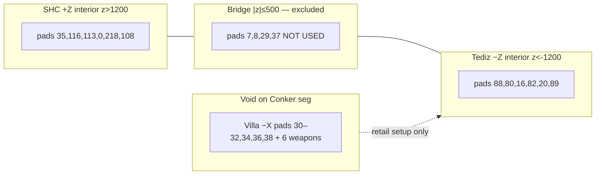
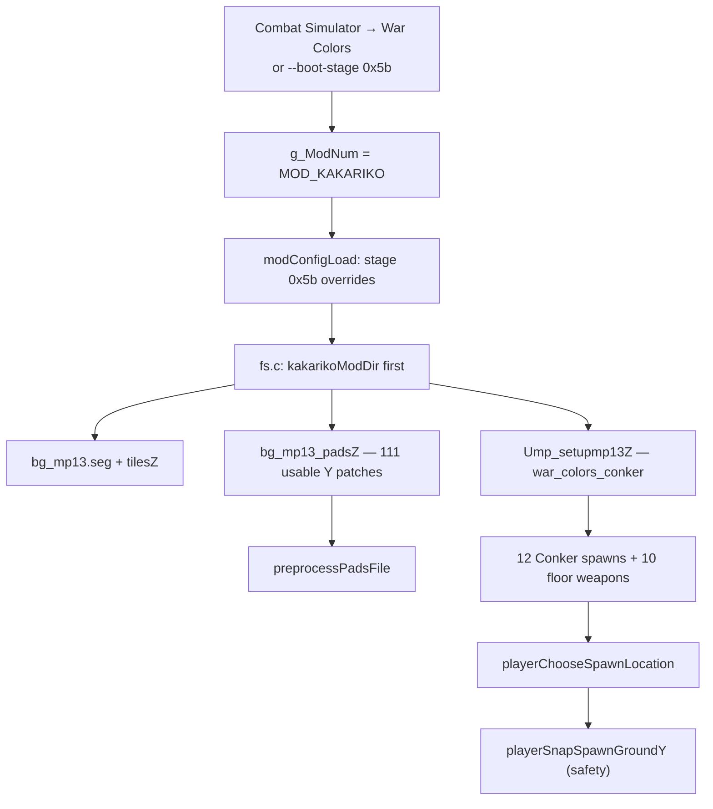

# War Colors Level Reference

**Stage:** `STAGE_EXTRA26` (`0x5b`) — *War Colors* (Conker BFD Total War / Golden Nintendo Maps)  
**Mod slot:** `MOD_KAKARIKO` (`2`) — retail **mp13** file IDs (`bg_mp13.*`, `Ump_setupmp13Z`)  
**Retail alias:** `STAGE_MP_VILLA` (`0x35`) shares the same mp13 file IDs in `stagetable.c`

---

## Key insight (what we misunderstood)

War Colors is **not** “retail mp13 with wrong Y values.” Golden Nintendo Maps (Sogun) replaced **only seg + tiles** in the mp13 slot with Conker BFD geometry. The **pad graph XY** stayed Villa/GNM-aligned (219 pads), and **`Ump_setupmp13Z` still pointed at Villa Deathmatch spawn/weapon pad indices** (`001C`–`0027`, `00BD`–`00C6`).

**Seven of twelve retail spawn pads and six of ten retail weapon pads sit at XY that have no Conker floor** (extreme Villa −X Tediz coords, e.g. X < −4000). Y-correction and `player.c` void filtering could not fix that — the setup intro was aiming at the wrong pads for Conker.

**Correct fix (Jul 2026):**

1. Deploy **`Ump_setupmp13Z` from `src/levels/war_colors_conker.py`** — 12 balanced spawns + 10 floor weapons on **Conker-probed usable pad indices**.
2. Deploy **`bg_mp13_padsZ`** with Conker floor **Y** patched for **all 111 usable pads** (full `--probe-war-colors-all` pass).
3. Keep Conker **seg/tiles** in `mod_kakariko`; **`player.c` ground snap remains a safety net** for any remaining CTF/hill pads at void XY.

Original N64 GNM mod almost certainly used the **same retail Villa setup**; on N64, spawn did not reject void pads the way the PC port does — so the mismatch was latent until Conker geometry + collision probing.

---

## Three layers

| Layer | Asset | War Colors source | Role |
|-------|--------|-------------------|------|
| **A. Geometry** | `bg_mp13.seg`, `bg_mp13_tilesZ` | `mod_kakariko` (Conker BFD) | SHC fortress (+Z ridge), Tediz tunnels (−Z), center bridge |
| **B. Pad graph** | `bg_mp13_padsZ` (219 pads) | `mod_kakariko` (Conker Y probe) | Spawn / weapon / AI / CTF anchor positions |
| **C. Setup script** | `Ump_setupmp13Z` intro + props | `mod_kakariko` (`war_colors_conker`) | `INTROCMD_SPAWN`, floor weapons, CTF cases, KOTH hills |

Retail ROM layer C references layer B pad **indices** designed for **Villa** floors. Conker layer A removed floors at many of those XY — layer C must be rewritten for Conker.

---

## Top-down layout (world X/Z, Y up)

```text
                    +Z  SHC fortress interior (z > 1200)
                         ┌─────────────────────────────┐
                         │  spawns: 35,116,113,0,218,108│
                         │  weapons: 190,198,192,100,35 │
                         └──────────────┬──────────────┘
                                        │ bridge (|z|≤500) — NO team spawns/weapons
                         ┌──────────────┴──────────────┐
                         │  EXCLUDED: 7,8,29,37        │
                         └──────────────┬──────────────┘
                                        │
                    −Z  Tediz tunnel interior (z < −1200, prefer < −2000)
                         ┌─────────────────────────────┐
                         │  spawns: 88,80,16,82,20,89  │
                         │  weapons: 16,80,88,20,82    │
                         └─────────────────────────────┘

     Team zones (teams mode): SHC z>1200, Tediz z<−1200. No bridge fallback.
```



---

## Asset load order



| File | mod_kakariko | mod_allinone | Runtime |
|------|--------------|--------------|---------|
| `bgdata/bg_mp13.seg` | yes | no | mod_kakariko |
| `bgdata/bg_mp13_tilesZ` | yes | no | mod_kakariko |
| `bgdata/bg_mp13_padsZ` | **yes (111 Y patches)** | no | mod_kakariko |
| `files/Ump_setupmp13Z` | **yes (Conker setup)** | no | mod_kakariko |
| `Usetupmp13Z` | no | no | ROM |

---

## Retail vs Conker setup — spawn pads

Retail `Ump_setupmp13Z` intro: `spawn(001C)` … `spawn(0027)` — indices **28–39**.

| Idx | Name | X | Z | Zone | Retail Y | Conker ground | Retail setup | Conker setup |
|----:|------|--:|--:|------|----------:|--------------:|:------------:|:------------:|
| 28 | 001C | 1010 | −1546 | Tediz | −506 | −691 | yes | **yes** |
| 29 | 001D | 538 | 79 | bridge | −316 | −310 | yes | **yes** |
| 30 | 001E | −4463 | −1873 | Tediz void | −516 | — | yes | **no** |
| 31 | 001F | −5085 | −2504 | Tediz void | −516 | — | yes | **no** |
| 32 | 0020 | −5314 | −1652 | Tediz void | −366 | — | yes | **no** |
| 33 | 0021 | −3307 | 2070 | SHC void | −416 | — | yes | **no** |
| 34 | 0022 | −3847 | 999 | SHC void | 84 | — | yes | **no** |
| 35 | 0023 | −526 | 3043 | SHC | 84 | −102 | yes | **yes** |
| 36 | 0024 | −2421 | −1552 | Tediz void | −516 | — | yes | **no** |
| 37 | 0025 | 1515 | 309 | bridge | −316 | −262 | yes | **yes** |
| 38 | 0026 | −5115 | −1325 | Tediz void | −246 | — | yes | **no** |
| 39 | 0027 | 1108 | 1086 | SHC | −96 | −269 | yes | **yes** |

**Conker Deathmatch spawns (12)** — `src/levels/war_colors_conker.py` — **inside bases only**:

| Idx | Name | X | Z | Zone | Conker ground Y |
|----:|------|--:|--:|------|----------------:|
| 35 | 0023 | −526 | +3043 | SHC interior | −102 |
| 116 | 0074 | −463 | +2984 | SHC interior | −116 |
| 113 | 0071 | 37 | +2774 | SHC interior | −418 |
| 0 | 0000 | −1428 | +2126 | SHC interior | +325 |
| 218 | 00DA | −1612 | +2085 | SHC interior | +325 |
| 108 | 006C | 184 | +2485 | SHC interior | −170 |
| 88 | 0058 | −1915 | −3163 | Tediz deep tunnel | −1334 |
| 80 | 0050 | −2000 | −2973 | Tediz deep tunnel | −905 |
| 16 | 0010 | −1897 | −2722 | Tediz deep tunnel | −842 |
| 82 | 0052 | −2031 | −2642 | Tediz deep tunnel | −665 |
| 20 | 0014 | −2402 | −2417 | Tediz deep tunnel | −765 |
| 89 | 0059 | −1676 | −2818 | Tediz deep tunnel | −1041 |

**Previously wrong:** pads 29,37,7,8 (bridge |z|≤500), pad 39 (z=+1086 mid-zone), pads 13/28/11/148 (shallow Tediz −1073..−1615, not deep tunnel interior).

---

## Retail vs Conker setup — floor weapons

Retail props: `WEAPON_MPLOCATION00`–`09` at pads **189–198** (+ ammo **199–218**).

| Idx | Name | Zone | Usable on Conker | In Conker setup |
|----:|------|------|:----------------:|:---------------:|
| 189 | 00BD | Tediz | yes | yes + ammo 199,200 |
| 190 | 00BE | SHC | yes | yes + ammo 201,202 |
| 191 | 00BF | Tediz void | **no** | replaced by 149 |
| 192 | 00C0 | SHC | yes | yes + ammo 205,206 |
| 193 | 00C1 | Tediz void | **no** | — |
| 194–197 | 00C2–00C5 | void | **no** | extras 151–153,16,93 |
| 198 | 00C6 | SHC | yes | yes + ammo 217 |

**Conker floor weapons (10)** — all inside base interiors:

| Slot | Pad | Name | X | Z | Zone |
|------|----:|------|--:|--:|------|
| 00 | 190 | 00BE | 643 | +1304 | SHC interior |
| 01 | 198 | 00C6 | −1978 | +2092 | SHC interior |
| 02 | 192 | 00C0 | −2220 | +1413 | SHC interior |
| 03 | 100 | 0064 | 1076 | +1990 | SHC interior |
| 04 | 35 | 0023 | −526 | +3043 | SHC interior |
| 05 | 16 | 0010 | −1897 | −2722 | Tediz deep tunnel |
| 06 | 80 | 0050 | −2000 | −2973 | Tediz deep tunnel |
| 07 | 88 | 0058 | −1915 | −3163 | Tediz deep tunnel |
| 08 | 20 | 0014 | −2402 | −2417 | Tediz deep tunnel |
| 09 | 82 | 0052 | −2031 | −2642 | Tediz deep tunnel |

**Previously wrong:** pads 149,152 (z=−1055 mid-zone, not inside Tediz base), pad 189 (z=−1284 shallow tunnel mouth).

---

## Pad graph probe summary (219 pads)

| Metric | Count |
|--------|------:|
| Total pads | 219 |
| Usable on Conker floor | **111** |
| Void (no `cdFindGround` at XY) | 108 |
| Retail DM spawn pads usable | 5 / 12 |
| Retail floor-weapon pads usable | 4 / 10 |

**Why seven Tediz retail spawns are void:** Conker seg trimmed Villa geometry west of ≈ X −3500. Retail pads **001E–0020, 0024, 0026** sit in that removed volume — not a probe bug (room may still resolve from bbox, ground does not).

---

## Golden Nintendo Maps / original mod intent

- `mods/mod_kakariko/modconfig.txt` credits Sogun / n64vault (*Golden Nintendo Maps*, *Kakariko Village*).
- GNM replaced **mp13 seg/tiles** only; **no custom `Ump_setupmp13Z`** has been found in repo history — the N64 pack reused **retail Villa mp13 setup + pad graph**.
- `STAGE_EXTRA26` in `stagetable.c` points at the same mp13 file IDs as Villa MP; All-in-One registers the stage name “War Colors.”

---

## Regenerate assets

```bash
cmake --build build --target pd -j8

# Conker setup → mods/mod_kakariko/files/Ump_setupmp13Z
python3 tools/pdmap.py build war_colors_conker --deploy --mod mod_kakariko

# All usable pad Y patches → mods/mod_kakariko/files/bgdata/bg_mp13_padsZ
python3 tools/war_colors_correct_pads.py --pd build/pd.arm64 --all
```

Or use `./scripts/play-conker-war-sentry.sh` (build + deploy + probe + launch).

**Do not** rebuild mp13 pads with `tools/assetmgr/mkpads` from JSON — output does not round-trip through runtime preprocess.

Probe logs: `journal/map_learn/.war_colors_pad_probe.log`, `.war_colors_all_pads_probe.log`

---

## Launch

```bash
./scripts/play-conker-war-sentry.sh              # 8 sims, teams, sentry flags
./scripts/play-conker-war-sentry.sh --solo       # human-only smoke test
./scripts/launch-perfect-dark-aio.sh             # menu → Combat Simulator → War Colors
```

Boot path loads:

```
fsFileLoad: files/Ump_setupmp13Z → mods/mod_kakariko/files/Ump_setupmp13Z
fsFileLoad: files/bgdata/bg_mp13_padsZ → mods/mod_kakariko/files/bgdata/bg_mp13_padsZ
```

---

## Verification (Jul 2026)

Conker setup + full pad probe:

```
WARNING: spawn: stage=5b pos=(1010,-691,-1546) ground=-691 room=19 pads=12
WARNING: spawn: stage=5b pos=(-1612,325,2085) ground=325 room=19 pads=12
WARNING: spawn: stage=5b pos=(36,-317,226) ground=-317 room=19 pads=12
```

`ground` equals Conker floor at spawn XY across SHC, Tediz, and bridge zones. **12 spawn points** for up to 12 simultaneous players; 8 sims + 1 human fit without pad reuse.

Logs: `journal/map_learn/.war_colors_conker_verify.log`

---

## Limitations

- **CTF / KOTH** intro still references retail case/hill pad indices; some case pads remain void on Conker (Deathmatch is fully corrected).
- **`playerWarColorsSpawnPadIsUsable()`** still filters void pads for non-DM scenarios and mis-clicked retail indices.
- Experimental 64-spawn overlay: `./scripts/play-conker-war-sentry.sh --deploy-custom` (`conker_war_sentry_inf`).

---

## Related files

| Path | Role |
|------|------|
| `docs/WAR_COLORS_LEVEL.md` | This reference |
| `src/levels/war_colors_conker.py` | Conker-correct `Ump_setupmp13Z` source |
| `mods/mod_kakariko/modconfig.txt` | Stage `0x5b` asset overrides |
| `mods/mod_kakariko/files/Ump_setupmp13Z` | Deployed Conker setup |
| `mods/mod_kakariko/files/bgdata/bg_mp13_padsZ` | 111 usable Y patches |
| `port/src/warcolors_probe.c` | In-engine probe + N64 pad writer |
| `tools/war_colors_correct_pads.py` | Probe wrapper (`--all` = 219 pads) |
| `src/setups/mp_setupmp13.c` | Retail Villa setup (reference) |
| `src/assets/ntsc-final/pads/mp13.json` | Pad positions (219 pads) |
| `scripts/play-conker-war-sentry.sh` | Build, deploy, probe, launch |
| `src/game/player.c` | Void filter + Conker ground snap (safety net) |
